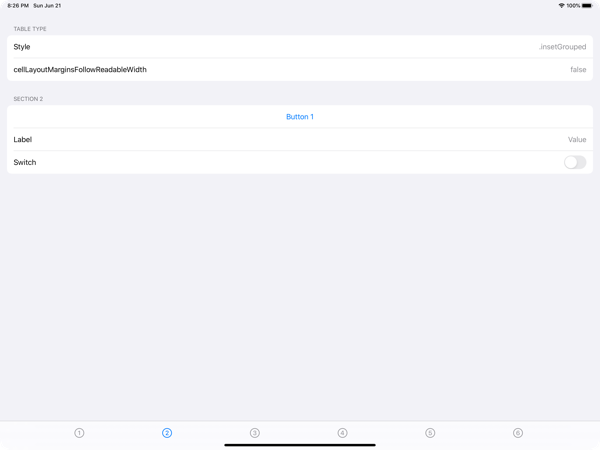
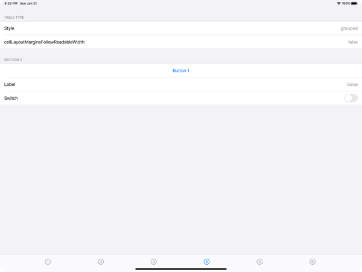
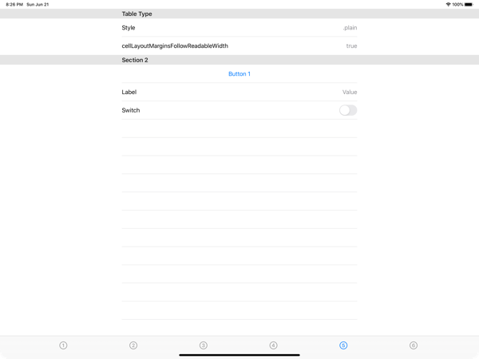
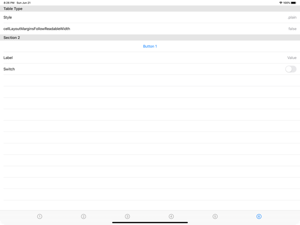

# EurekaTableTypes

The EurekaTableTypes project demonstrates how to present [Eureka](https://github.com/xmartlabs/Eureka) forms using the various styles of UITableView.

## style: .insetGrouped, cellLayoutMarginsFollowReadableWidth = true

## style: .insetGrouped, cellLayoutMarginsFollowReadableWidth = false

## style: .grouped, cellLayoutMarginsFollowReadableWidth = true

## style: .grouped, cellLayoutMarginsFollowReadableWidth = false

## style: .plain, cellLayoutMarginsFollowReadableWidth = true

## style: .plain, cellLayoutMarginsFollowReadableWidth = false

